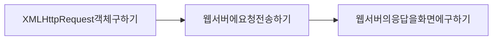

1일차(DOM & Ajax Programming)
=============================

Ajax의 구성
-----------

#### 1.XMLHttpRequest

> 브라우저에서 생성 <br>웹 서버와의 통신 담당

#### 2.DOM(Document Object Model)

> 요청결과를 화면출력 <br>문서 구조 담당

#### 3. CSS

> 글자색, 배경색 등의 UI 담당

#### 4. 자바스크립트=>이벤트를 연결

> 사용자의 동작 감지, XMLHttpRequest와 DOM, CSS 사이의 중개

---

Ajax의 동작 프로그래밍 순서
---------------------------



#### XMLHttpRequest객체구하기

---

simple.txt

```
utf-8
```

simple2.txt

```
ansi
```


