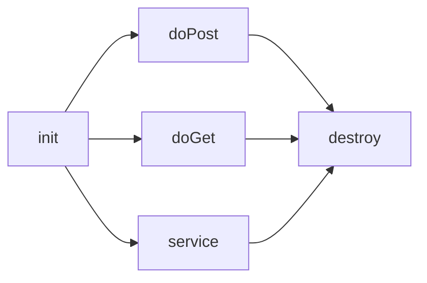

1일차
-----

#### 스크립트릿 : 웹상에서 자바코드를 사용할 수 있도록 해주는 영역

-	<% ~ %> => 태그사용X(자바스크립트 X)

-	표현식도 사용불가합니다!

#### 표현식(expression) : 간단하게 출력문 대용으로 사용

-	변수값 출력,메소드 호출(결과값을 출력)

-	형식) <%=변수명%> or <%=객체명.일반메소드명(~)%>

-	<%=정적메소드명(~)%>

#### 선언문(Declaration)

-	스크립트릿과 모양이 유사하다.

-	<%! ~ %>

-	선언된 위치에 상관없이 변수를 불러다가 사용이 가능하다(변수선언)

-	메소드 장석이 가능하다(정적 메소드 느낌)

#### 주석

-	\<!-- 눈에 보이는 주석 --> =>html주석
-	<%-- 눈에 안보이는 주석 --%>
-	자바주석-> //, /* ~ \*/

2일차
-----

#### 한글처리

-	contentType="text/html; charset=UTF-8" ==>텍스트형태의 html문서로 만들어서 보내주되 한글이 결과에 포함이 되어있다면 한글이 깨지지 않은상태로 보내주세요

-	pageEncoding="UTF-8"=>한글처리해주세요

-	import=>외부에서 패키지를 불러올때 사용

	1.	<%@ page language="java" contentType="text/html; charset=UTF-8" pageEncoding="UTF-8" import="java.util.Date" %>
	2.	<%@ page import="java.io.\*,java.util.\*" %> =>속성값을 여러개 나열->,,,
	3.	<%@ page import="java.sql.\*" %> =>세로로 여러개의 import속성을 쓸 수있다.

#### 서블릿의 조건

-	import javax.servlet.\* //서블릿의 클래스 import javax.servlet.http.\*;//웹상에서의 접속에 관련된 정보 import java.io.\*;//입출력

> c:\tomcat8.5\lib->servlet-api.jar파일에 저장

-	반드시 publi class로 작성해야 된다.=>누구나 접속이 가능하게 해주기위해

-	반드시 httpServlet클래스를 상속받아야 된다.



3일차
-----

-	자동적으로 action="box_proc.jsp로 전송한다.

```
<input type="submit" value="표만들기">
```

<br>

-	자동적으로 action="box_proc.jsp로 (전송 X)

-	document.폼객체명.submit()을 꼭 써줘야 된다.

```
<input type="button" value="표만들기" onclick="함수명()">
```

---

내장객체 (8~9가지) //내장객체 선언

1.	PageContext pageContext;//서블릿을 관리하고 정보를 공유하도록 도와주는 객체

2.	**HttpSession session = null; //세션(회원 로그인 해서 결재할때)**

3.	ServletContext application; //application(모든 jsp페이지에서 공통으로 사용하는 객체)

4.	ServletConfig config;//서블릿의 환경설정에 관여하는 객체

5.	**JspWriter out = null; //출력객체( 데이터를 전송할때 필요)**

6.	**page = this; //jsp작성할때 마다 만들어진 객체**

7.	JspWriter \_jspx_out = null;

8.	PageContext \_jspx_page_context = null;

9.	**HttpServletRequest request ->요청객체**

10.	**HttpServletResponse response->응답객체**

---

response
--------

```
response.setContentType("text/html;charset=utf-8");
response.sendRedirect("경로포함해서 이동할 페이지명");

```

#### 페이지 이동에 관하여..!

##### 1. reponse 객체

URL창이 이동할 페이지로 전환이 되면서 이동이 된다.

```
response.sendRedirect("http://www.chosun.com"); //외부의 사이트로 이동
                      ->http를 반드시 넣어야함
response.sendRedirect("./req.jsp"); //상대경로를 지정(내부파일 이동)
=> URL창이 이동할 페이지로 전환이 되면서 이동이 된다.

```

##### 2. forward 액션태그

URL창이 이동할 페이지로 전환이 되지 않는다.

```
외부의 사이트로 이동불가
자기 프로젝트의 다른 페이지로만 이동이 가능하다.(O)
URL창이 이동할 페이지로 전환이 되지않는다.

결론=> 데이터를 공유하면서 페이지를 이동시킬 수가 있다.

회원가입 페이지 (1,2,3 ..등등)이 있을때
페이지가 이동하면 데이터를 공유하면서 페이지를 이동한다.
```

##### 3. 자바스크립트

```
location.href="이동할 페이지명" //기록
location.replace("http://~이동할 페이지명") //노기록

전의 페이지로 이동
history.back()

전의 페이지로 이동
history.go(-1)-

앞의 페이지로 이동
history.forward()
```

액션태그
--------

JSP에서 자주 사용하는 특정 동작들에 대해서 미리 만든 예약어

메인페이지(index.jsp : top jsp,bottom jsp,left jsp,right jsp)

=> 객체를 생성,Setter,Getter 태그

#### 액션태그의 종류

1.	UseBean
2.	setProperty
3.	getProperty
4.	includeforward

```
*****************flush*******************
 화면에 출력하기 전까지 버퍼에 쌓아놓음(8kb)
 flush하면 나오는 현상
 1. 더이상 쿠키를 집어넣을수 없습니다.
 2. 더이상 서버쪽에서는 다른 페이지로 이동시킬수 없습니다.
 3. 더이상 헤더를 넣을수 없습니다.
```

<식별자 : 액션태그명 액션태그의 속성명="속성값" ~/>

| include 액션태그                          | include 지시어         |
|-------------------------------------------|------------------------|
| 동적으로 변경된 내용을 특정한 위치에 삽입 | 정적으로 문자열만 복사 |

4일차
-----

#### 자바빈즈의 3가지

##### 1. 객체를 생성->useBean 태그

```
 //BeanTest bt=new BeanTest();
 <jsp:useBean id="객체명"  class="패키지명.클래스명"  scope="사용범위" />
```

-	page->현재 jsp내에서만(default)

-	request->한페이지 이상

-	session->로그인한 동안

-	application->모든 페이지

```
<jsp:useBean id="bt" class="test.BeanTest" scope="page" />
```

##### 2. ->Setter 호출

형식)

```
<jsp:setProperty name="객체명" property="멤버변수명(str)" value="저장할값" />
<jsp:setProperty name="bt" property="str"  value="<%=변수명%>" />
```

##### 3.Getter Method를 대신 사용할 수 있는 태그

<%=bt.getStr() %>

```
형식)
<jsp:getProperty name="객체명 " property="멤버변수명" />
<jsp:getProperty name="bt " property="str" />
```

5일차
-----

#### 쿠키와 세션

##### 공통점

둘다 클라이언트 서버와의 연결을 일정시간동안 유지시켜주는 방법(로그인)

##### 차이점

| 구분          | 쿠키                                                                        | 세션                                                                                                     |
|---------------|-----------------------------------------------------------------------------|----------------------------------------------------------------------------------------------------------|
| 저장위치      | 파일로저장                                                                  | 서버의 메모리에저장                                                                                      |
| 특징          | 해킹의 소지<br>개인정보의 유출 가능성이 있다.                               | 30분(default)유지<br>30분후 자동종료                                                                     |
| 저장방법      | Cookie 인스턴트명=new Cookie("이름","값")<br>response.addCookie(인스턴트명) | 세션의 메모리에 저장(HashMap)<br>session.setAttribute(키,저장할값(계정id))<br>session.getAttribute(키명) |
| 저장되는 형식 | 텍스트                                                                      | Object                                                                                                   |
| 리소스        | 클라이언트의 리소스 사용                                                    | 서버의 리소스 사용                                                                                       |
| 용량제한      | 한 도메인당 20개<br>쿠키하나당 4kb<br>총 300개                              | 서버가 허용하는 용량                                                                                     |

#### DB연동 방법

자바와 웹

| 분류     | Java Application                                 | Web Application                                                |
|----------|--------------------------------------------------|----------------------------------------------------------------|
| 전역설정 | C:\jdk1.8\jre\lib\ext에 넣기                     | C:\Tomcat 8.5\lib에 넣기                                       |
| 지역설정 | 다른경로에 jdbc를 복사해서<br>path 변수를 선언쿠 | <center>WebContent안에<br>WEB-INF안에<br>lib안에 넣기</center> |

8일차
-----

#### 3. 매개변수를 전달하기위한 4가지 방법

##### ㄱ. 링크문자열을 이용해서 페이지 전환할때 사용

```java
<a href="DelCheckForm.jsp?mem_id=<%=mem_id%>">회원탈퇴</a>
```

##### ㄴ. Rrequest객체 또는 Session객체를 이용한 데이터 공유방법

```java
<a href="MemberUpdate.jsp">회원수정</a>
String mem_id=(String)session.getAttribute("idKey");
```

##### ㄷ. \<form>태그 내부에 \<input type="hidden" ~>값을 전달하는 경우

```html
<input type="hidden" name="전달할매개변수명" value="전달할 값">
<input type="hidden" name="mem_id" value="<%=mem_id %>">
```

##### ㄹ. action="delePro.jsp?mem_id=<%=mem_id%>

9일차
-----

1.show databases;==>현재 어떤 데이터베이스 목록확인

-	mysql>show databases; //탐색기의 폴더처럼 생각

2.특정 DB에 접속->들어가고 싶다.

-	use 전환할 DB명

-	mysql> use mysql; //DB에는 테이블이 들어있다.

-	Database changed

3.DB에 들어가 있는 테이블을 보여주세요(목록)

-	mysql>show tables;

-	mysql> show tables;

4.desc user; //구조확인

5.select * from user;

10일차(모델1의 게시판- 글목록보기와 글쓰기)
-------------------------------------------

#### 글목록보기

##### 1. mysql 라이브러리 추가

**2. list.jsp 작성**

​ C:\webtest\4.jsp\모델1의 게시판자료\게시판디자인\list.html 파일을 list.jsp 파일로 만든다

​ WebContent폴더에 images 폴더 복사&붙여넣기

1.	**데이터 넣기**

	-	C:\webtest\4.jsp\10일차(모델1의 게시판-글목록보기,글쓰기 구현)\boardInsert.SQL

	-	```sql
		insert into board values(1,'조수영','nup49rok1@empal.com','[공지사항]게시판사용법',
		'1234','2017-12-26 17:23',3,0,0,0,'게시판 테스트','127.0.0.1');
		```

---

#### 글쓰기

신규글만 작성 : num , ref , re_step , re_level의 매개변수 값이 X

답변글을 작성 : num , ref , re_step , re_level의 매개변수 값이 O

1.	BoardDAO 에서 insertArticle() 메서드 작성

2.	writerForm.jsp -> writerPro.jsp 작성

	-	게시판디자인 폴더에서 writeForm , script , style 파일 가져오기(WebContent 폴더

	-	```
		onsubmit="return writerSave()"
		writerSave() 호출 하면서 필수 입력을 하지 않은 경우 반환값이 false
		문제가 없다면 true -> writerPro.jsp로 전송
		```

		​

11일차
------

#### 다양한방법으로 매개변수를 전달하는 경우

```
action="updatePro.jsp?num=<%=num%>&pageNum=<%=pageNum%>"
```

```
action="updatePro.jsp"
```

```
<input type="hidden" name="num" value="<%=num%>">
<input type="hidden" name="pageNum" value="<%=pageNum%>">
```

13일차
------

forEach.jsp
-----------

자바에서의 for문

```java
int sum=0;
for(int i=1;i<=100;i++){
	sum +=i;
}
```

jstl에서의 forEach문

```java
<c:forEach var="i" begin="1" end="100" step="2">
<c:set var="sum" value="${sum+i}" />
</c:forEach>
```
