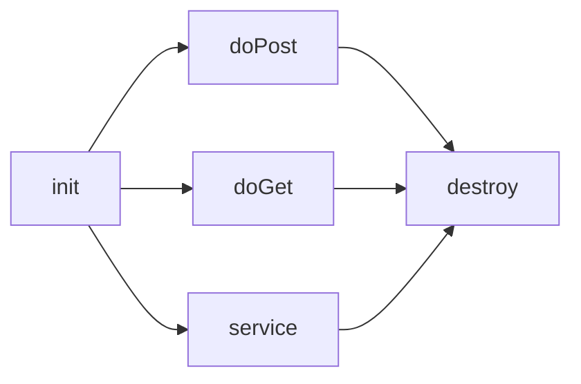

2일차(서블릿 프로그래밍(서블릿개요 및 작성법)
=============================================

서블릿과 JSP의 관계

서블릿의 개요

서블릿활용

-	공지사항 팝업창(자바스크립트(open)),파일로부터 읽어들임(=파일입출력)

-	서블릿

---

```
Jsp활용2

1. 반복할 문자열 입력(next()로 받기)
-> 안녕하세요

2. 반복할 횟수를 입력(nextInt()로 받기)
-> 3

안녕하세요?
안녕하세요?
안녕하세요?


input2.jsp(문자,숫자) : 요청페이지
while.jsp : 응답페이지

두 jsp파일이 커뮤니케이션을 통하여 처리하기


```

### request랑 response차이점 정확하게 파악하기

---

지시어
------

#### jsp파일의 선언문

톰캣서버에게 **속성**으로 요청을 하는 선언문

| 형식        | 지시어                                             |
|-------------|----------------------------------------------------|
| <%@ page    | page지시어                                         |
| <%@ include | include지시어<br>모델1:웹사이트의 기본             |
| <%@ taglib  | taglib지시어<br>모델2:큰 규모의 사이트<br>(Spring) |

<br>

```
p 792
  <%@ page language="java" contentType="text/html; charset=UTF-8" pageEncoding="UTF-8"%>
  <%@ page import ="java.io.*,java.util.*" %>
  속성값을 여러개 나열가능
  <%@ page import="java.sql.*"%>
  세로로 여러개의 imprt 속성을 쓸 수 있다.

```

1.	language="java"

	jsp가 자바로 작성되었다!(생략가능)

2.	contentType="text/html"; charset="UTF-8"

	텍스트형태의 html문서로 만들어서 보내주시구요 한글이 결과에 포함(UTF-8)되어있습니다. 한글이 깨지지 않은 상태로 보내주세요

3.	pageEncoding="UTF-8"

	이것도 한글처리로 부탁드리겠습니다.

4.	page import ="java.io.*,java.util.*"

	속성값을 여러개 나열가능

	page import="java.sql.*"

	세로로 여러개의 imprt 속성을 쓸 수 있다.

<%@ page IsThreadSafe

-	<%@ page IsThreadSafe="false">로 설정을 하면 홈페이지의 동시접속이 불가능해진다.

-	<%@ page IsThreadSafe="true"> 는 디폴트 값임

---

Servlet
-------

Server Side Applet(서버상에서 실행되는 웹프로그래밍)<br>외부 사용자가 브라우저로 접속하면 자동으로 실행되는 프로그래밍

#### 서블릿의 조건

1.	import javax.servlet.* //서블릿의 클래스

	import javax.servlet.http.*// 웹상에서의 접속

	import java.io.* //입출력

	=>C:/tomcat8.5/lib (servlet-api.jar 파일에 저장)

2.	반드시 public class로 작성해야 한다.(누구나 접속이 가능하게 해주기 위해서)

3.	반드시 httpServlet 클래스로 상속받아야 된다.

	-	사이트에 접속할 때 마다 처리해주는 기능을 가지고 있다.

		get===============>doGet()메소드를 사용하기 위해서

		post==============>doPost()

	-	service()

		-	get으로 접속해도 service()호출
		-	post로 접속해도 service()호출



<br><br>

```
7월 07, 2017 12:49:33 오후 org.apache.catalina.core.StandardContext reload
정보: Reloading Context with name [/ServletTest] is completed
```

단독 서블릿 실행

-	사용자로부터 값을 읿력을 받아서 처리해주는 서블릿

post로 접속 --> doPost()처리 or service(){콜백메소드 자동으로 호출}

```
요청을 하는 jsp ---------------> 요청을 처리해주는 jsp

요청을 하는 jsp(or html) ----> 요청을 처리해주는 서블릿
  이름,주소 입력(input.jsp) ->
```

page 지시어 include 지시어 -> 메인 페이지를 작성할때 사용 => include 액션태그

공통으로 자주 사용이 되는 페이지의 내용을 따로 파일로 만들어서 불러올 때 자주사용(ex.언어쪽)

includeTest.jsp
