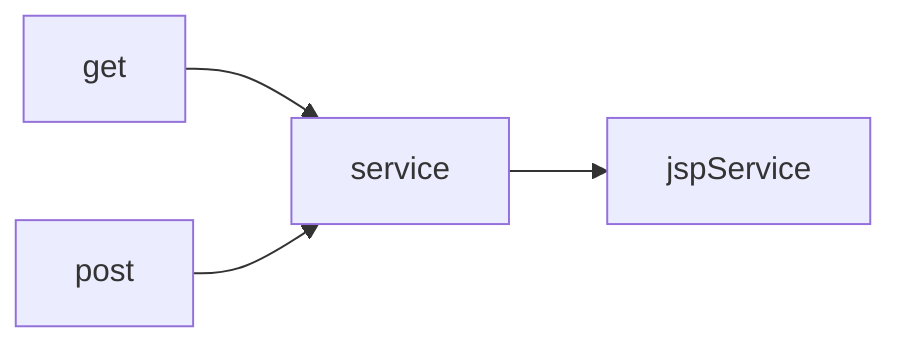
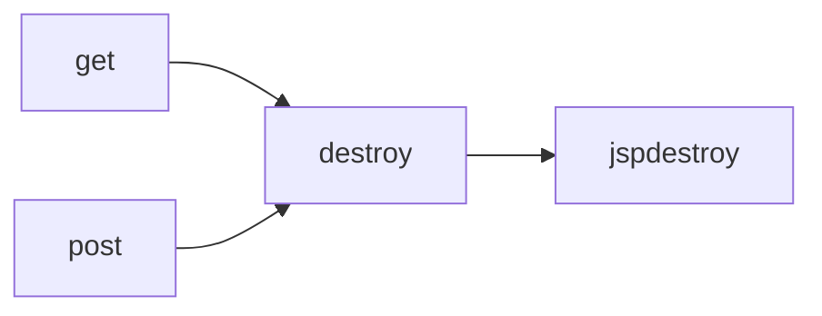

3일차(내장객체,액션태그 작성방법)

서블릿(대부분 80%(자바소스)+20%(html,css,js~) =>실행속도가 빠르다 =>Jsp(html,css,js+최소한의 자바코드)=>규모가 크게되면 중소규모 사이트(모델1) 중복소스 코드 늘어남-->서블릿+jsp(모델2)=>표준

기본형식) window.document.폼객체명.입력양식객체명.속성명=값 객체명.함수명(~)

---

#### with 함수!!

```html
  if(documnet.BoxForm.tr_cnt.options.selectedIndex==0)
  if(documnet.BoxForm.td_cnt.options.selectedIndex==0)

  에서 documnet.BoxForm은 중복된다.

  documnet.BoxForm => **with**로 묶자 !

  with(documnet.BoxForm){
      if(tr_cnt.options.selectedIndex==0)

      if(tr_cnt.options.selectedIndex==0
       }

```

---

```
자바스크립트의 모든것

http://kin.naver.com/open100/detail.nhn?d1id=1&dirId=1040202&docId=246154&qb=7J6Q67CU7Iqk7YGs66a97Yq4IGRpduyViOyXkCDtj6ztlajrkJwg66qo65Og66y47J6Q&enc=utf8&section=kin&rank=1&sort=0&spq=0&pid=f1Pk5B331xGsstT/bbKssv--192224&sid=S1eaaq@LV0sAACaCFq4


자바스크립트의 각 form 접근
http://www.mungchung.com/xe/lecture/4197
```

---

### jsp와 서블릿의 관계를 확인

box_proc.jsp로 구성 -> 응용 서블릿으로 변환


```
사용자 정의 서블릿

import javax.servlet.\*;
import javax.servlet.http.\*; (사용자 정의 서블릿과 동일)

                  +

1. import javax.servlet.jsp.\*; // js를 위한 서블릿 패키지가 추가

2. public final class => 상속 금지

3. org.apache.jasper.runtime.HttpJspBase
                              =========
 HttpSerclet을 상속 --> HttpJspBase를 상속받게 되어있다.
      부모                 자식
```

```
4. 서블릿 실행 -> init() --> _jsp_Init()로 변경된다.
  get or post --> service --> __jspService
                  destroy --> __jspdestroy
  **웹상에서 요청 및 처리해주는 메소드 service()--->_jspService()**
```

<center>





</center>

---

내장객체 (8~9가지) //내장객체 선언

1.	PageContext pageContext;//서블릿을 관리하고 정보를 공유하도록 도와주는 객체

2.	**HttpSession session = null; //세션(회원 로그인 해서 결재할때)**

3.	ServletContext application; //application(모든 jsp페이지에서 공통으로 사용하는 객체)

4.	ServletConfig config;//서블릿의 환경설정에 관여하는 객체

5.	**JspWriter out = null; //출력객체( 데이터를 전송할때 필요)**

6.	**page = this; //jsp작성할때 마다 만들어진 객체**

7.	JspWriter \_jspx_out = null;

8.	PageContext \_jspx_page_context = null;

9.	**HttpServletRequest request ->요청객체**

10.	**HttpServletResponse response->응답객체**

```
try {
      //내장객체 생성부분
      response.setContentType("text/html; charset=UTF-8");
      pageContext = _jspxFactory.getPageContext(this, request, response,
                null, true, 8192, true);
      _jspx_page_context = pageContext;
      application = pageContext.getServletContext();
      config = pageContext.getServletConfig();
      session = pageContext.getSession();
      out = pageContext.getOut();
      _jspx_out = out;
```

---

### request,response,out,session

request
-------

```java
1.String getServerName()<br>
서버의 도메인 이름을 반환<br>
<%=request.getServerName() %>

2.int getServerPort()<br>
서버의 포트 번호를 반환<br>
<%=request.getServerPort() %>

***** 3.String getRequestURL()<br>
요청된 URL에서 경로를 반환<br>
<%=request.getRequestURL() %>
http프로토콜부터 요청문서까지의 경로 전체

***** 4.String getRequestURI()<br>
요청된 URI에서 경로를 반환<br>
<%=request.getRequestURI() %>
서버포트이후 부터 요청문서까지의 경로

***** 5.String getRemoteAddr(원격ip 주소)()<br>
클라이언트의 주소를 반환<br>
<%=request.getRemoteAddr() %>


6.String getProtocol()<br>
클라이언트가 요청한 프로토콜을 반환<br>
<%=request.getProtocol() %>


***** 7.String getMethod()<br>
요청 방식(GET, POST)을 반환<br>
<%=request.getMethod() %>

```

response
--------

```
response.setContentType("text/html;charset=utf-8");
response.sendRedirect("경로포함해서 이동할 페이지명");

```

#### 페이지 이동에 관하여..!

##### 1. reponse 객체

URL창이 이동할 페이지로 전환이 되면서 이동이 된다.

```
response.sendRedirect("http://www.chosun.com"); //외부의 사이트로 이동
                      ->http를 반드시 넣어야함
response.sendRedirect("./req.jsp"); //상대경로를 지정(내부파일 이동)
=> URL창이 이동할 페이지로 전환이 되면서 이동이 된다.

```

##### 2. forward 액션태그

URL창이 이동할 페이지로 전환이 되지 않는다.

```
외부의 사이트로 이동불가
자기 프로젝트의 다른 페이지로만 이동이 가능하다.(O)
URL창이 이동할 페이지로 전환이 되지않는다.

결론=> 데이터를 공유하면서 페이지를 이동시킬 수가 있다.

회원가입 페이지 (1,2,3 ..등등)이 있을때
페이지가 이동하면 데이터를 공유하면서 페이지를 이동한다.
```

##### 3. 자바스크립트

```
location.href="이동할 페이지명" //기록
location.replace("http://~이동할 페이지명") //노기록

전의 페이지로 이동
history.back()

전의 페이지로 이동
history.go(-1)-

앞의 페이지로 이동
history.forward()
```

액션태그
--------

JSP에서 자주 사용하는 특정 동작들에 대해서 미리 만든 예약어

메인페이지(index.jsp : top jsp,bottom jsp,left jsp,right jsp)

=> 객체를 생성,Setter,Getter 태그

#### 액션태그의 종류

1.	UseBean
2.	setProperty
3.	getProperty
4.	includeforward

<jsp:include page="sub.jsp" flush="false"/>

```
*****************flush*******************
 화면에 출력하기 전까지 버퍼에 쌓아놓음(8kb)
 flush하면 나오는 현상
 1. 더이상 쿠키를 집어넣을수 없습니다.
 2. 더이상 서버쪽에서는 다른 페이지로 이동시킬수 없습니다.
 3. 더이상 헤더를 넣을수 없습니다.
```

<식별자 : 액션태그명 액션태그의 속성명="속성값" ~/>

| include 액션태그                          | include 지시어         |
|-------------------------------------------|------------------------|
| 동적으로 변경된 내용을 특정한 위치에 삽입 | 정적으로 문자열만 복사 |
| angular or react(새로고침 F5)             | 특정한 위치에 삽입     |

모든페이지에서 다 공유해서 사용할수있는 사용범위

---

ex) request.setAttribute("total",su);//int->Integer->Object->형변환

```
  request.setAttribute("cal",d);
```

---

move.jsp---------------->a.jsp (sum->100)

```
            ---------------->b.jsp (str->출력)->shared!

                                   request.getAttribute(키명)
```

==========================================

메인페이지 사용법->include,forward태그를 사용

```
                         활용(ex 제약회사 홈페이지)
```

자바빈즈의 개요 및 작성법->useBean,setProperty,getProperty

쿠키와 세션->DB
