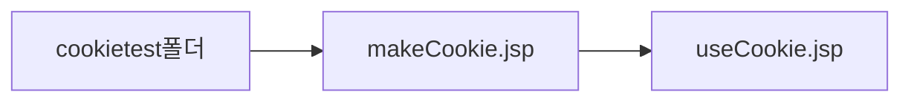
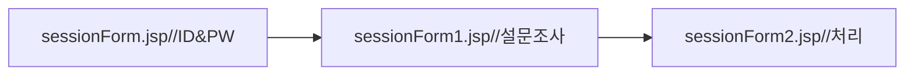

5일차(자바빈즈 정리및 쿠키와 세션,JDBC Programming)
===================================================

####

한페이지에서 계산기 계산하기

```html
cal.jsp

<%@ page language="java" contentType="text/html; charset=UTF-8"
    pageEncoding="UTF-8"%>
<!DOCTYPE html PUBLIC "-//W3C//DTD HTML 4.01 Transitional//EN" "http://www.w3.org/TR/html4/loose.dtd">

<jsp:useBean id="ca" class="calc.CalcBean" scope="page" />
<jsp:setProperty name="ca" property="*"  />
<%  ca.calculate();  %>

<html>
<head>
<meta http-equiv="Content-Type" content="text/html; charset=UTF-8">
<title>요청을 하는 페이지(빈즈이용)</title>
</head>
<body>
 <center>
   <h3>계산기</h3>
   <form name="form1" method="post">
    <input type="text" name="num1" width="200" size="5">
    <select name="operator">
       <option selected>+</option>
       <option>-</option>
       <option>*</option>
       <option>/</option>
    </select>
    <input type="text" name="num2" width="200" size="5"><p>
    <input type="submit" value="계산" name="b1">
    <input type="reset" value="다시입력" name="b2">
   </form>
   <hr>
   계산결과:<%=ca.getResult() %><br>
   계산결과2:<jsp:getProperty name="ca" property="result" />
 </center>
</body>
</html>

```

```java
beans.java

package calc;

public class CalcBean {
   // 멤버변수는 <input type="text" name="num1"와 반드시 일치
   private int num1, num2;
   private String operator = "";// 연산자
   private int result;// 연산결과값을 저장할 변수

   public int getNum1() {
      return num1;
   }

   public void setNum1(int num1) {
      this.num1 = num1;
      System.out.println("setNum1()호출됨!");
   }
    /* Tomcat 8.5기준
     * <jsp:setProperty name="~" property="*"/>->에러유발
   public void setNum1(String num1) {
      this.num1 = Integer.parseInt(num1);
      System.out.println("setNum1()호출됨!");
   }
   */
   public int getNum2() {
      return num2;
   }

   public void setNum2(int num2) {
      this.num2 = num2;
      System.out.println("setNum2()호출됨!");
   }

   public int getResult() {
      return result;
   }
   //5+3=8
   public  void  calculate() {
      //+
      if(operator.equals("+")) {
         result=num1+num2;
      }
      //-
      if(operator.equals("-")) {
         result=num1-num2;
      }
      //*
      if(operator.equals("*")) {
         result=num1*num2;
      }
      // /
      if(operator.equals("/")) {
         result=num1/num2;
      }
   }

   public void setOperator(String operator) {
      this.operator = operator;
      System.out.println("setOperator() 호출됨!");
   }
}

```

쿠키와 세션
-----------

#### 공통점

둘다 클라이언트 서버와의 연결을 일정시간동안 유지시켜주는 방법(로그인)

#### 차이점

| 구분          | 쿠키                                                                        | 세션                                                                                                     |
|---------------|-----------------------------------------------------------------------------|----------------------------------------------------------------------------------------------------------|
| 저장위치      | 파일로저장                                                                  | 서버의 메모리에저장                                                                                      |
| 특징          | 해킹의 소지<br>개인정보의 유출 가능성이 있다.                               | 30분(default)유지<br>30분후 자동종료                                                                     |
| 저장방법      | Cookie 인스턴트명=new Cookie("이름","값")<br>response.addCookie(인스턴트명) | 세션의 메모리에 저장(HashMap)<br>session.setAttribute(키,저장할값(계정id))<br>session.getAttribute(키명) |
| 저장되는 형식 | 텍스트                                                                      | Object                                                                                                   |
| 리소스        | 클라이언트의 리소스 사용                                                    | 서버의 리소스 사용                                                                                       |
| 용량제한      | 한 도메인당 20개<br>쿠키하나당 4kb<br>총 300개                              | 서버가 허용하는 용량                                                                                     |

쿠키 !
------

저장 경로!

```
C:\Users\kitcoop\AppData\Roaming\Microsoft\Windows\Cookies
```

#### ㄱ. 실습 경로



#### ㄴ. makeCookie.jsp(쿠키생성)

```java

makeCookie.jsp


</head>
<%
String cookiename="mycookie";
Cookie c = new Cookie(cookiename,"Samsung");//쿠키이름,쿠키값
c.setMaxAge(60*2); //쿠키의 생명시간(양수:초 0: 쿠키삭제 음수:웹끄면끝)
c.setValue("LifeisGood");//중간에 쿠키의 값을 변경시킬때 사용
response.addCookie();
%>
<body>
```

#### ㄷ. useCookie.jsp(쿠키사용)

```java
<body>
<h1> 웹브라우저 저장된 쿠키를 가져오는 예제</h1>
<%
Cookie[] cookies = request.getCookies();//쿠키를 배열형태로 저장
if(cookies!=null){//검색할 쿠키의 정보가 들어있다면
    for(int i=0;i<cookies.length;i++){
        if(cookies[i].getName().equals("mycookie")){%>
        cookie Name:<%=cookies[i].getName() %><br>
        cookie Value:<%=cookies[i].getValue() %>
    <%
    }
    }
}
%>
</body>
```

세션!
-----



#### ㄱ.sessionForm.jsp (아이디 비밀번호 입력폼)

```html
<form method="post" action="sessionTest1.jsp">
    id:<input type="text" name="id"><p>
    passwd:<input type="password" name="passwd"><p>
   <input type="submit" value="로그인">
 </form>
```

#### ㄴ.sessionForm1.jsp (설문조사 입력폼)

```html
<%
//인증 성공
String id=request.getParameter("id");
String passwd=request.getParameter("passwd");
System.out.println("id"+id);
System.out.println("pass"+passwd);
session.setAttribute("idkey",id);//default 30분
//(실험인데 30분을 기다릴순없지? 1분으로 바꾸자)
session.setMaxInactiveInterval(1800);//60초
%>

 <form method="post" action="sessionTest2.jsp">
   <h2>가장 좋아하는 스포츠를 선택하세요</h2><br>
   <input type="radio" name="sports" value="농구">농구
   <input type="radio" name="sports" value="유도">유도
   <input type="radio" name="sports" value="야구">야구
   <input type="radio" name="sports" value="이종격투기">이종격투기<p>

   <h2>가장 좋아하는 계절를 선택하세요</h2><br>
   <select name="season">
     <option value="봄">봄</option>
     <option value="여름">여름</option>
     <option value="가을">가을</option>
     <option value="겨울">겨울</option>
   </select>
   <input type="submit" value="전송">
  </form>
```

#### ㄷ.sessionForm2.jsp (실제 처리)

```html
<%

request.setCharacterEncoding("utf-8");
String sports=request.getParameter("sports");
String season=request.getParameter("season");
//서버 : 접속한 클라이언트 구분(세션 id)

//session.setAttribute("idkey",id); <--꺼내 먹는법!
String id = (String)session.getAttribute("idkey");

String seesionid=session.getId();
int interval = session.getMaxInactiveInterval();
if(id!=null){//현재 계정으로 로그인했다면
%>
<b><%=id %></b>야 ! 너 <b><%=sports %></b>좋아하지?<p>
계절은 <b><%=season %></b> 좋아하지?<p>
세션유지시간 : <%=interval %>초<p>
<%
}else{
out.println("세션이 만료되었습니다");
}%>
```

interval이 끝날때까지 session의 id값은 계속 유지된다.

즉 id값으로 접속자를 판별함

---

<br>

JDBC Programming정리
--------------------

### 실습 순서


### DB연동 방법

#### 자바와 웹

| 분류     | Java Application                                 | Web Application                                                |
|----------|--------------------------------------------------|----------------------------------------------------------------|
| 전역설정 | C:\jdk1.8\jre\lib\ext에 넣기                     | C:\Tomcat 8.5\lib에 넣기                                       |
| 지역설정 | 다른경로에 jdbc를 복사해서<br>path 변수를 선언쿠 | <center>WebContent안에<br>WEB-INF안에<br>lib안에 넣기</center> |

### Statement vs PreparedStatement

Statement 객체의 SQL은 실행될 때 매번 서버에서 분석되어야 하는 반면,

PreparedStatement 객체는 한 번 분석되면 재사용이 용이하다

[PreparedStatement]

-	동일한 질의문을 특정값만 바꾸어서 여러 번 실행해야 할때

-	많은 데이터를 다루기 때문에 질의문을 정리해야 될 필요가 있을때

-	인수가 많아서 질의문을 정리해야 될 필요가 있을때

[Statement]

-	단순한 질의문을 실행할때

### 자바빈즈의 3가지 종류

#### 1.DB Connection빈 : DB연결관리(연결 및 해제)

-	DBConnectionMgr.Java를 응용하자

(1) B에 관련된 설정정보만 변경 시켜둔다.

```java
private String _driver = "oracle.jdbc.driver.OracleDriver",
    _url = "jdbc:oracle:thin:@localhost:1521:orcl",
    _user = "scott",
    _password = "tiger";

```

(2) DBConnectionMgr클래스의 객체를 생성 **getConnection() 필요**

```java
//커넥션풀객체를 선언
    private static DBConnectionMgr instance = null;

    public DBConnectionMgr() {
    }

    /** Use this method to set the maximum number of open connections before
     unused connections are closed.
     */

    //커넥션풀을 얻어오는 정적메소드
    public static DBConnectionMgr getInstance() {
        //커넥션풀이 생성이 안되어있다면
		if (instance == null) {
            synchronized (DBConnectionMgr.class) {
                //생성이 안되어있다면
				if (instance == null) {
					//객체생성
                    instance = new DBConnectionMgr();
                }
            }
        }
        return instance;//호출한 클래스쪽으로 반환
    }
```

(3) freeConnection()을 이용해서 ->DB메모리 해제구문

```java
public void freeConnection(Connection c, PreparedStatement p, ResultSet r) {
        try {
            if (r != null) r.close();
            if (p != null) p.close();
            freeConnection(c);
        } catch (SQLException e) {
            e.printStackTrace();
        }
    }
```

#### 2. SQL 구문을 실행 : 자바빈즈의 메소드 선언(메소드를 호출)

-	DAO(Data Access Object) => DB접속 후 => 메소드 선언

#### 3. DTO(데이터 저장빈) : Setter,Getter 메소드 구성(테이블의 필드와 연관)
