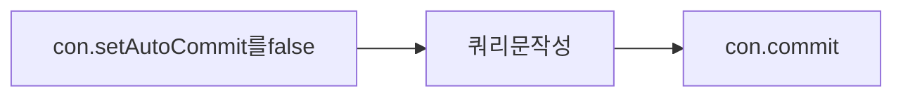

7일차(우편번호 검색 및 회원가입,회원수정전까지 구현)
====================================================

### MemberDAO 메소드의 공통점

```JAVA
Connection  con=null;
PreparedStatement pstmt=null;
ResultSet rs=null;
String sql="";//실행시킬 sql구문
try {
        con=pool.getConnection(); //DB접속

---------------쿼리 작성 ---------------------

    }catch(Exception e) {
            System.out.println("checkId()실행 에러유발->"+e);
    }finally {
            pool.freeConnection(con, pstmt, rs); //DB해제
    }
```

##### 1. DB를 연결

-	con=pool.getConnection();

##### 2. 쿼리작성

-	select insert update delete ~~~

##### 3. DB를 해제

-	pool.freeConnection(con, pstmt, rs);

---

우편번호
--------

### 1. MemberDAO의 zipcodeRead 메소드

> rs는 객체를 한번에 담아두는 것이아니라 실행대기상태로 next와 previous를 받음. 따라서 전체의 객체를 받으려면 Vector나 ArrayList를 사용해야함

```java
public  Vector<ZipcodeDTO>  zipcodeRead(String area3) {

            Connection  con=null;
            PreparedStatement pstmt=null;
            ResultSet rs=null;//select
            //추가
            Vector<ZipcodeDTO> vecList=new Vector();
            String sql="";//실행시킬 sql구문
            //2.실행시킬 SQL구문이 필요
            try {
                con=pool.getConnection();
                sql="select * from zipcode where area3 like '"+area3+"%'";
                pstmt=con.prepareStatement(sql);
                rs=pstmt.executeQuery();
                //레코드가 한개 이상
                while(rs.next()) {
                    //vector or ZipcodeDTO(필드별로 저장(Setter)->rs.getXXX(필드명)
                    ZipcodeDTO tempZipcode=new ZipcodeDTO();
                    tempZipcode.setZipcode(rs.getString("zipcode"));//("142-890");
                    tempZipcode.setArea1(rs.getString("area1"));
                    tempZipcode.setArea2(rs.getString("area2"));
                    tempZipcode.setArea3(rs.getString("area3"));
                    tempZipcode.setArea4(rs.getString("area4"));
                    //vector or ArrayList에 담는 구문
                    vecList.add(tempZipcode);//대략 13개의 레코드가 저장이 된다.
                }
            }catch(Exception e) {
                System.out.println("zipcodeRead() 실행 에러유발->"+e);
            }finally {//3.DB연결해제
                pool.freeConnection(con, pstmt, rs);
            }
            return vecList;
        }        
```

> \<ZipcodeDTO>를 벡터에 선언해 주어서 후에 Object형에서 형변환시 (ZIPcodeDTO)를 명시해주지 않아도 되며 메소드가 명확해짐.

```
다시보는 제너릭

public  Vector<ZipcodeDTO>  zipcodeRead(String area3) {
...
Vector<ZipcodeDTO> vecList=new Vector();
...

```

<br>

### 2. Script.js의 zipcheck메소드

> window.open(경로,"제목","옵션")

```java
function zipCheck(){
url = "ZipCheck.jsp?check=y"    
window.open(url,"title","toolbar=no,width=500,height=300,menubar=no,status=yes,scrollbars=yes")
}

```

<br>

### 3. ZipCheck.jsp

> trim : 공백제거

```java
<%@ page language="java" contentType="text/html; charset=UTF-8"
    pageEncoding="UTF-8"
    import="java.util.*,hewon.*" %>
<!DOCTYPE html PUBLIC "-//W3C//DTD HTML 4.01 Transitional//EN" "http://www.w3.org/TR/html4/loose.dtd">
<jsp:useBean id="memMgr" class="hewon.MemberDAO" />
<%  request.setCharacterEncoding("UTF-8");
    String check=request.getParameter("check");
    String area3=request.getParameter("area3");

    System.out.println("check=>"+check+",area3=>"+area3);
    //MemberDAO memMgr=new MemberDAO();
    Vector<ZipcodeDTO> zipcodeList=memMgr.zipcodeRead(area3); //zipcodeList -> 벡터형태
    System.out.println("자료의 갯수는"+zipcodeList.size());
%>
for(int i=0;i<zipcodeList.size();i++){
     ZipcodeDTO zipBean=zipcodeList.elementAt(i);
     String tempZipcode=zipBean.getZipcode();//우편번호
     String tempArea1=zipBean.getArea1().trim();//시
     String tempArea2=zipBean.getArea2().trim();//구
     String tempArea3=zipBean.getArea3().trim();//동
     String tempArea4=zipBean.getArea4().trim();//나머지
```

---

<br><br>

회원가입
--------

### 1. MemberDAO의 memberInsert메소드

<br>

#### 트랜젝션

오라클에서 여러개의 테이블을 가지고 트랜잭션을 처리할때

| 분류    | 테이블A(Insert) | 테이블B(Update) |
|---------|-----------------|-----------------|
| 좋은 예 | Insert성공      | Update성공      |
| 나쁜 예 | Insert실패      | Update성공      |

따라서 Insert가 실패하면 Update도 안되도록 하나의 작업으로 묶어서 처리하는 작업이 필요하다.



#### ㄱ. 자동커밋 비활성화

> con.setAutoCommit(false)

```java
con.setAutoCommit(false);
```

#### ㄴ. 쿼리문 작성

```java
sql="insert into member values(?,?,?,?,?,?,?,?)";
pstmt=con.prepareStatement(sql);
pstmt.setString(1, mem.getMem_id());
pstmt.setString(2, mem.getMem_passwd());
pstmt.setString(3, mem.getMem_name());
pstmt.setString(4, mem.getMem_email());
pstmt.setString(5, mem.getMem_phone());
pstmt.setString(6, mem.getMem_zipcode());
pstmt.setString(7, mem.getMem_address());
pstmt.setString(8, mem.getMem_job());
int insert=pstmt.executeUpdate(); //성공여부
}   
```

#### ㄷ. 자동커밋 활성화

> java con.commit()

```java
java con.commit();//실질적으로 insert가 작동됨

if(insert>0) {
                    check=true;
                }
            }catch(Exception e) {
                System.out.println("memberInsert()실행 에러유발->"+e);
            }finally {//3.DB연결해제
                pool.freeConnection(con, pstmt);
            }
            return check;
```
